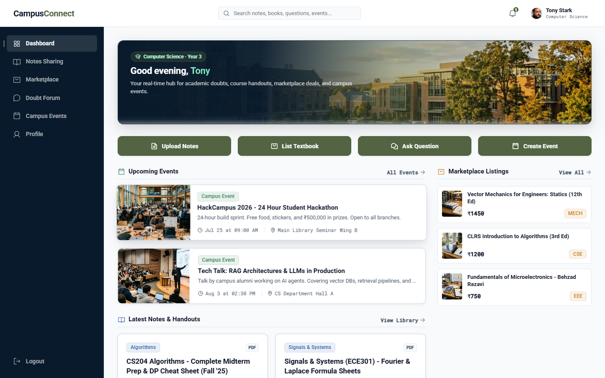
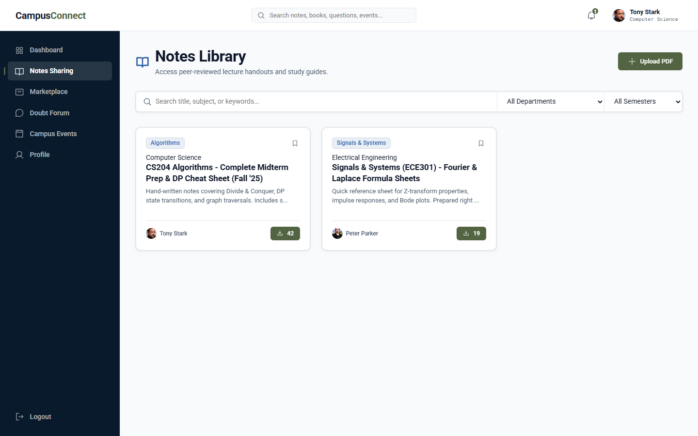
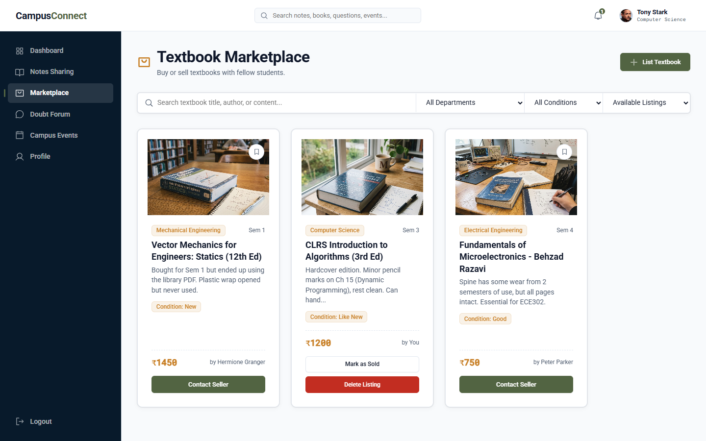
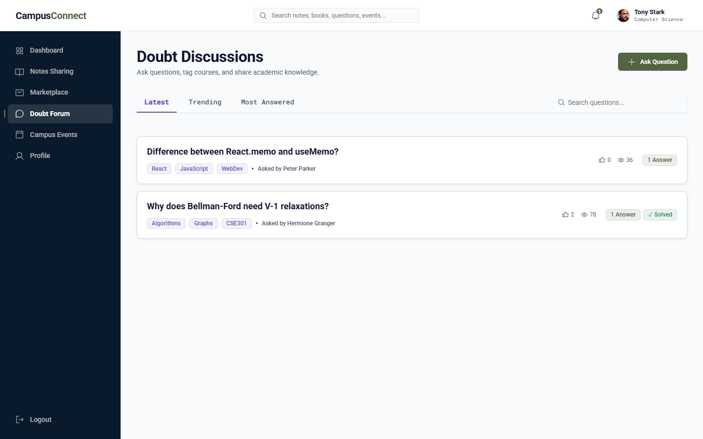
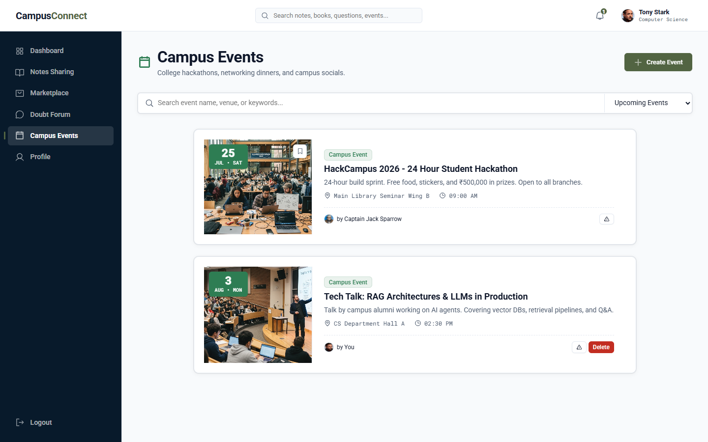
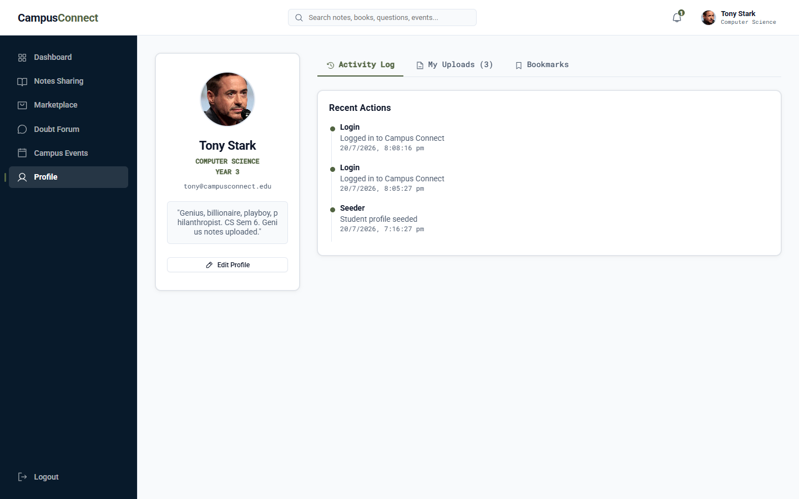

# CampusConnect

A MERN stack web application built to help college students share course notes, buy and sell second-hand textbooks, ask academic doubts, and stay updated on campus events.



---

## About The Project

During college, notes and study materials are often scattered across WhatsApp groups, finding second-hand textbooks from seniors is messy, and course questions get lost in long chat threads. 

I built **CampusConnect** to solve these problems by bringing all essential campus academic tools into a single platform. Students can filter study resources by department and semester, list unused textbooks for sale, post questions for peers to answer, and discover upcoming college events.

---

## Features

- **Notes Sharing Library**: Upload and download PDF notes, lecture slides, and past question papers categorized by department and semester.
- **Book Marketplace**: Post unused textbooks for sale with prices and condition details, mark books as sold, and view seller contact info.
- **Doubt Discussion Forum**: Ask course questions, reply with answers, upvote helpful responses, and mark the best answer as accepted.
- **Campus Events**: Browse upcoming hackathons, tech talks, and college events with venue details and bookmark options.
- **User Profiles & Bookmarks**: Track your uploaded notes, listed textbooks, and saved bookmarks in one place.
- **Admin Moderation**: Dedicated admin view to monitor platform stats, resolve reported content, and manage user accounts.

---

## Screenshots

### Dashboard


### Notes Sharing Library


### Textbook Marketplace


### Doubt Discussion Forum


### Campus Events


### Student Profile


---

## Tech Stack

- **Frontend**: React.js, React Router DOM, Axios, Custom CSS
- **Backend**: Node.js, Express.js
- **Database**: MongoDB, Mongoose ORM
- **Authentication**: JWT (JSON Web Tokens), bcryptjs
- **File Uploads**: Multer

---

## How to Run Locally

### Prerequisites
Make sure you have the following installed on your machine:
- [Node.js](https://nodejs.org/) (v18 or higher)
- [MongoDB](https://www.mongodb.com/) (running locally or a MongoDB Atlas URI)

---

### Step 1: Clone the Repository
```bash
git clone https://github.com/riconpriyankara/CampusConnect.git
cd CampusConnect
```

---

### Step 2: Backend Setup
1. Go into the backend directory:
   ```bash
   cd backend
   ```
2. Install dependencies:
   ```bash
   npm install
   ```
3. Create a `.env` file in the `backend` folder:
   ```env
   PORT=5000
   MONGO_URI=mongodb://127.0.0.1:27017/campus_connect
   JWT_SECRET=campusconnect_secret_key
   JWT_EXPIRE=30d
   NODE_ENV=development
   ```
4. Seed sample mock data (adds initial users, notes, books, and events):
   ```bash
   npm run seed
   ```
5. Start the backend server:
   ```bash
   npm run dev
   ```
   *The backend will run at `http://localhost:5000`*

---

### Step 3: Frontend Setup
1. Open a new terminal and go into the frontend directory:
   ```bash
   cd frontend
   ```
2. Install dependencies:
   ```bash
   npm install
   ```
3. Start the React development server:
   ```bash
   npm run dev
   ```
   *The frontend will run at `http://localhost:3001` (or `http://localhost:3000`)*

---

## Test Accounts

You can test the application using these pre-created accounts:

| User Type | Email | Password |
| :--- | :--- | :--- |
| **Student** | `tony@campusconnect.edu` | `student123` |
| **Student** | `peter@campusconnect.edu` | `student123` |
| **Student** | `hermione@campusconnect.edu` | `student123` |
| **Admin** | `admin@campusconnect.edu` | `admin123` |

---

## What I Learned Building This Project

- How to structure a full-stack MERN application with separate frontend and backend directories.
- Implementing JWT authentication and storing user sessions securely in localStorage.
- Using Multer middleware for file uploads (PDF handouts and image banners).
- Designing MongoDB schemas with Mongoose references for user profiles, upvotes, and bookmarks.
- Building a clean, responsive user interface using Vanilla CSS variables.

---

## Future Improvements

- Add real-time chat between textbook buyers and sellers.
- Integrate cloud storage (AWS S3 or Cloudinary) for file uploads.
- Add email notifications for new doubt replies and saved event reminders.

---

## License

This project is open-source and available under the [MIT License](LICENSE).
