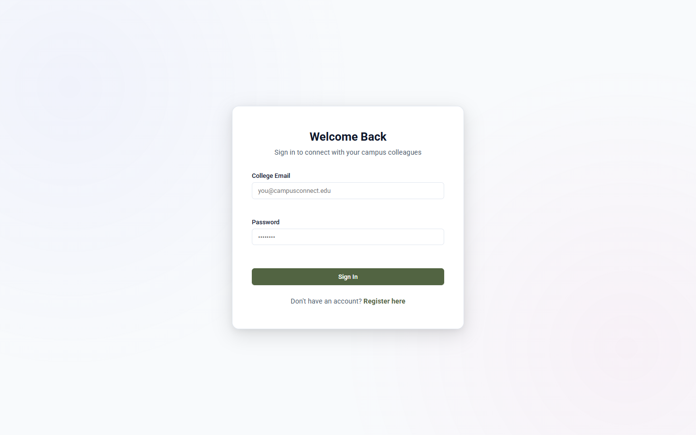
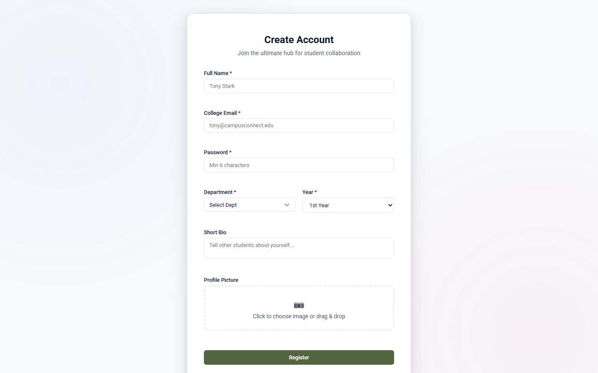

# Campus Connect


<div align="center">

[](https://react.dev/)
[](https://nodejs.org/)
[](https://expressjs.com/)
[](https://www.mongodb.com/)
[](https://jwt.io/)
[](https://vitejs.dev/)
[](LICENSE)

</div>

---

## 📋 Table of Contents
- [Project Overview](#-project-overview)
- [Key Features](#-key-features)
- [Screenshots Gallery](#-screenshots-gallery)
- [Architecture Diagram](#-architecture-diagram)
- [Tech Stack](#-tech-stack)
- [Project Structure](#-project-structure)
- [Getting Started](#-getting-started)
  - [Prerequisites](#prerequisites)
  - [Backend Setup](#step-1-backend-setup)
  - [Database Seeding](#step-2-seed-mock-data)
  - [Frontend Setup](#step-3-frontend-setup)
- [API Summary](#-api-summary)
- [Engineering Challenges Solved](#-engineering-challenges-solved)
- [What I Learned](#-what-i-learned)
- [Future Improvements](#-future-improvements)
- [License](#-license)

---

## 🎓 Project Overview

**Campus Connect** is a full-stack academic platform built using the MERN stack (MongoDB, Express, React, Node.js). It consolidates student academic collaboration into a single web application: peer-reviewed notes sharing, second-hand textbook marketplace, academic doubt discussions, and campus event coordination.

Rather than relying on scattered messaging groups and ad-hoc bulletin boards, Campus Connect provides a centralized, department-categorized directory designed for modern university students.

---

## ✨ Key Features

- **🔒 Authentication & Role Security**: User registration and login with bcrypt password hashing, JWT session persistence, protected routes, and role-based authorization (Student vs. Admin).
- **📚 Notes Sharing Library**: Course handout directory supporting PDF uploads via Multer, download tracking, department/semester filtering, and bookmarking.
- **🛍️ Textbook Marketplace**: Student-to-student textbook listings featuring image uploads, condition tags, status toggling (`Available` / `Sold`), and direct seller contact info.
- **💬 Academic Doubt Forum**: Threaded Q&A discussion board supporting tags, upvoting, accepted answer verification by post author, and view counting.
- **📅 Campus Events Calendar**: Campus-wide event hub with banner uploads, date scheduling, location tags, and bookmark subscriptions.
- **🔔 Real-Time Notifications**: Unread notification counter and activity alerts for answer replies, upvotes, and saved content.
- **🛡️ Administrative Moderation**: Dedicated admin dashboard for reviewing flagged content reports, purging violating posts, and managing user profiles.
- **🎨 Responsive UI & Physics-Based Motion**: Custom CSS design system with HSL tokens, dark mode elements, dynamic hero greetings, and hardware-accelerated card micro-interactions.

---

## 🖼️ Screenshots Gallery

### Dashboard

*Central campus hub featuring a dynamic time-of-day greeting, quick action shortcuts, upcoming events, latest handouts, and marketplace listings.*

---

### Notes Sharing Library

*Searchable repository for course handouts and past exam papers, organized by department and semester with PDF download tracking.*

---

### Textbook Marketplace

*Peer-to-peer textbook marketplace where students can list used textbooks, browse by condition, and connect directly with sellers.*

---

### Doubt Discussion Forum

*Interactive Q&A discussion forum with tag filtering, upvotes, and author-verified accepted answer badges.*

---

### Campus Events Directory

*Campus event calendar displaying upcoming hackathons, guest lectures, and student club activities with location details and bookmarking.*

---

### Student Profile & Activity

*User profile showing student credentials, bio, department/year tags, uploaded notes, listed books, and activity timeline.*

---

### Authentication Screens
| Login Screen | Registration Screen |
| :---: | :---: |
|  |  |
| *JWT authentication with email validation* | *Onboarding with department selection & avatar upload* |

---

## 📐 Architecture Diagram

```mermaid
graph TD
    subgraph Client Layer (React SPA)
        UI[React Components / Pages]
        Router[React Router DOM v6]
        Context[Auth & Notification Context]
        Axios[Axios API Client]
        UI --> Router
        UI --> Context
        Context --> Axios
    end

    subgraph API Gateway & Middleware
        Axios -->|Authorization: Bearer JWT| Server[Express.js Server]
        Server --> AuthMW[JWT Auth Middleware]
        Server --> UploadMW[Multer File Upload Middleware]
    end

    subgraph Controller Services
        AuthMW --> AuthCtrl[Auth Controller]
        AuthMW --> NotesCtrl[Notes Controller]
        AuthMW --> BooksCtrl[Books Controller]
        AuthMW --> DoubtsCtrl[Doubts Controller]
        AuthMW --> EventsCtrl[Events Controller]
        AuthMW --> AdminCtrl[Admin Controller]
    end

    subgraph Persistence Layer
        AuthCtrl & NotesCtrl & BooksCtrl & DoubtsCtrl & EventsCtrl & AdminCtrl --> Mongoose[Mongoose ORM]
        Mongoose --> DB[(MongoDB Database)]
        UploadMW --> DiskStorage[Local Uploads Directory]
    end
```

---

## 🛠️ Tech Stack

- **Frontend**: React 18, React Router DOM v6, Axios, Phosphor Icons, Custom Vanilla CSS
- **Backend**: Node.js, Express.js, Multer
- **Database**: MongoDB, Mongoose ORM
- **Authentication**: JSON Web Tokens (JWT), bcryptjs
- **Build Tooling**: Vite, ESLint, Concurrently

---

## 📁 Project Structure

```text
Campus Connect/
├── backend/
│   ├── config/             # MongoDB database connection configuration
│   ├── controllers/        # Express route handlers (Auth, Notes, Books, Doubts, Events, Admin)
│   ├── middleware/         # JWT verification, Multer file upload, error handling
│   ├── models/             # Mongoose schemas (User, Note, Book, Doubt, Answer, Event, Notification, Report)
│   ├── routes/             # API endpoints definitions
│   ├── uploads/            # Static file storage (profiles, notes, books, banners)
│   ├── utils/              # Database seeder script & helper functions
│   ├── .env.example        # Environment variable template
│   └── server.js           # Main Express server entry point
├── frontend/
│   ├── public/             # Static public assets & hero illustration
│   ├── src/
│   │   ├── components/     # Layout & UI components (Navbar, Sidebar, Footer, Modals)
│   │   ├── context/        # React Context providers (AuthContext, NotificationContext)
│   │   ├── pages/          # Application views (Dashboard, Notes, Books, Doubts, Events, Profile, Admin)
│   │   ├── services/       # Axios instance & API interceptors
│   │   ├── utils/          # Department helper functions
│   │   ├── App.jsx         # Application router & protected routes
│   │   ├── index.css       # Global design tokens & CSS custom variables
│   │   └── main.jsx        # React application root
│   ├── vite.config.js      # Vite build configuration
│   └── package.json
└── README/
    └── assets/             # Documentation screenshots
```

---

## 🚀 Getting Started

### Prerequisites
- **Node.js**: `v18.0.0` or higher
- **MongoDB**: Local MongoDB instance (`mongodb://127.0.0.1:27017/campus_connect`) or MongoDB Atlas URI

### Step 1: Backend Setup

1. Navigate to the backend directory:
   ```bash
   cd backend
   ```
2. Copy environment template:
   ```bash
   cp .env.example .env
   ```
3. Configure environment variables in `.env`:
   ```env
   PORT=5000
   MONGO_URI=mongodb://127.0.0.1:27017/campus_connect
   JWT_SECRET=campusconnect_secret_key_2026_development
   JWT_EXPIRE=30d
   NODE_ENV=development
   ```
4. Install dependencies:
   ```bash
   npm install
   ```

### Step 2: Seed Mock Data

Populate the database with realistic sample notes, textbooks, doubts, events, and user accounts:
```bash
npm run seed
```

**Default Seed Accounts:**
- **Admin**: `admin@campusconnect.edu` (Password: `admin123`)
- **Student**: `tony@campusconnect.edu` (Password: `student123`)
- **Student**: `peter@campusconnect.edu` (Password: `student123`)
- **Student**: `hermione@campusconnect.edu` (Password: `student123`)

### Step 3: Run Servers

1. **Start Backend**:
   ```bash
   cd backend
   npm run dev
   ```
   *Backend API runs at `http://localhost:5000`*

2. **Start Frontend**:
   ```bash
   cd frontend
   npm run dev
   ```
   *Frontend application runs at `http://localhost:3001` (or `http://localhost:3000`)*

---

## 🔌 API Summary

| Module | Base Path | Key Capabilities |
| :--- | :--- | :--- |
| **Auth & Profile** | `/api/auth` | User registration with profile picture upload, login, profile updates, and notification tracking. |
| **Notes Library** | `/api/notes` | Upload PDF handouts, search by department/semester, track download counters, and toggle bookmarks. |
| **Marketplace** | `/api/books` | Publish used textbooks, filter by condition/status (`Available`/`Sold`), and view seller contact details. |
| **Doubt Forum** | `/api/doubts` | Post questions, submit answers, upvote helpful responses, mark accepted answers, and filter by tags. |
| **Campus Events** | `/api/events` | Create campus events with banner images, filter upcoming dates, view venue details, and bookmark events. |
| **Admin Portal** | `/api/admin` | System health metrics, view flagged content reports, dismiss/purge reported posts, and manage users. |

*Protected routes require header `Authorization: Bearer <jwt_token>`.*

---

## 🧪 Engineering Challenges Solved

- **Stateless Authentication Flow**: Implemented JWT authentication with persistent localStorage storage and automatic token injection via Axios interceptors, enabling seamless page refreshes without re-login prompts.
- **Multipart Data & File Storage**: Built custom Multer middleware to process file uploads (PDF handouts, book photos, event banners, user avatars), organizing files into separate backend directories with sanitized filenames.
- **Complex MongoDB Relationships**: Modeled relational concepts in NoSQL using Mongoose references (`ref`), population methods, and subdocument arrays to handle thread answers, upvotes, bookmarks, and user activity logs.
- **Custom Hardware-Accelerated Design System**: Engineered a custom Vanilla CSS design system using CSS variables, flexbox/grid layouts, and `cubic-bezier` motion curves (`will-change: transform`) for butter-smooth hover interactions without external CSS heavy frameworks.

---

## 💡 What I Learned

- Designing RESTful API contracts with consistent JSON response structures and HTTP status codes.
- Managing application-wide state (user sessions, unread notifications, toast alerts) using React Context API.
- Structuring scalable full-stack project layouts adhering to controller-service separation of concerns.
- Optimizing web application UI performance using CSS hardware acceleration and dynamic asset delivery.

---

## 🔮 Future Improvements

- [ ] **Real-Time Buyer-Seller Chat**: Integrate Socket.io for instant messaging between textbook buyers and sellers.
- [ ] **Cloud Asset Storage**: Migrate static file uploads from local disk to AWS S3 or Cloudinary.
- [ ] **Automated Testing Suite**: Add unit tests (Jest) for backend controllers and end-to-end testing (Cypress) for core user flows.

---

## 📄 License

Distributed under the MIT License. See `LICENSE` for more information.
