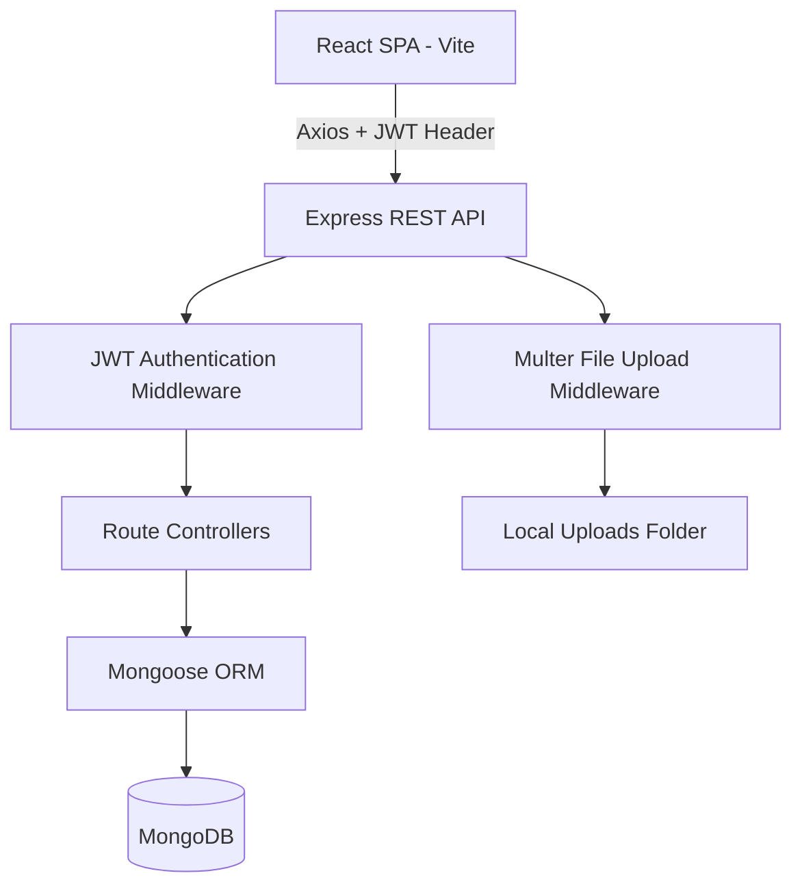

# CampusConnect

> A full-stack academic hub for college students to share course notes, buy & sell second-hand textbooks, ask course doubts, and find campus events.


[](https://react.dev/)
[](https://nodejs.org/)
[](https://expressjs.com/)
[](https://www.mongodb.com/)
[](LICENSE)

---

## 📌 About The Project

CampusConnect was created to address a common problem in university campuses: course materials are scattered across random group chats, finding used textbooks requires asking around manually, and course questions get lost in busy messaging threads.

This project brings all core academic activities into one organized platform categorized by department and semester.

### What it does:
- 📄 **Notes Sharing**: Upload and download PDF handouts and past papers filtered by department and semester.
- 📚 **Book Marketplace**: List second-hand textbooks for sale, mark items as available or sold, and contact sellers directly.
- 💬 **Doubt Forum**: Ask course questions, post answers, upvote helpful responses, and mark accepted answers.
- 🗓️ **Campus Events**: Discover upcoming hackathons, guest lectures, and student activities with location details and calendar bookmarks.
- 🛡️ **Admin Panel**: Review flagged content reports, purge policy-violating listings, and manage user accounts.

---

## 🖼️ Screenshots

| Dashboard Overview | Notes Sharing Library |
| :---: | :---: |
|  |  |
| *Personalized hero banner & quick shortcuts* | *Searchable PDF notes directory* |

| Textbook Marketplace | Doubt Discussion Forum |
| :---: | :---: |
|  |  |
| *Peer-to-peer textbook listings* | *Threaded Q&A with accepted answers* |

| Campus Events | Student Profile |
| :---: | :---: |
|  |  |
| *Event directory with location details* | *User activity & saved bookmarks* |

<details>
<summary><b>Click to view Auth Pages (Login & Register)</b></summary>

| Login | Register |
| :---: | :---: |
|  |  |

</details>

---

## 🏗️ System Architecture



---

## 🛠️ Tech Stack

### Frontend
- **Framework**: React 18 (Vite)
- **Routing**: React Router DOM v6
- **HTTP Client**: Axios with request/response interceptors
- **Icons**: Phosphor Icons & Lucide React
- **Styling**: Vanilla CSS with custom CSS variables and dark-mode tokens

### Backend
- **Runtime**: Node.js
- **Framework**: Express.js
- **Database**: MongoDB with Mongoose ORM
- **Authentication**: JWT (JSON Web Tokens) & bcryptjs password hashing
- **File Uploads**: Multer (handling PDF files and image uploads)

---

## ⚡ Quick Start

### Prerequisites
- [Node.js](https://nodejs.org/) (v18 or higher)
- [MongoDB](https://www.mongodb.com/) running locally (`mongodb://127.0.0.1:27017/campus_connect`) or a MongoDB Atlas connection string

### 1. Clone the repository
```bash
git clone https://github.com/riconpriyankara/CampusConnect.git
cd CampusConnect
```

### 2. Backend Setup
```bash
cd backend
npm install
```

Create a `.env` file in `backend/`:
```env
PORT=5000
MONGO_URI=mongodb://127.0.0.1:27017/campus_connect
JWT_SECRET=campusconnect_development_secret
JWT_EXPIRE=30d
NODE_ENV=development
```

Seed mock data (creates sample users, notes, books, doubts, and events):
```bash
npm run seed
```

Start the backend server:
```bash
npm run dev
```
*Backend runs on `http://localhost:5000`*

### 3. Frontend Setup
In a new terminal:
```bash
cd frontend
npm install
npm run dev
```
*Frontend runs on `http://localhost:3001` (or `http://localhost:3000`)*

---

## 🔑 Demo Login Credentials

You can log in using any of the pre-seeded accounts:

| Role | Email | Password |
| :--- | :--- | :--- |
| **Student** | `tony@campusconnect.edu` | `student123` |
| **Student** | `peter@campusconnect.edu` | `student123` |
| **Student** | `hermione@campusconnect.edu` | `student123` |
| **Admin** | `admin@campusconnect.edu` | `admin123` |

---

## 🔌 API Reference

### Authentication & Profile (`/api/auth`)
- `POST /api/auth/register` - Register a new student account (supports profile picture upload)
- `POST /api/auth/login` - Authenticate user & return JWT token
- `GET /api/auth/profile` - Fetch current user profile, bookmarks, and activity
- `PUT /api/auth/profile` - Update bio, department, year, or avatar

### Notes (`/api/notes`)
- `GET /api/notes` - Fetch notes (supports `search`, `department`, `semester` parameters)
- `POST /api/notes` - Upload a course handout (PDF upload via Multer)
- `POST /api/notes/:id/bookmark` - Save or unsave a note
- `POST /api/notes/:id/download` - Track note download count

### Marketplace (`/api/books`)
- `GET /api/books` - Fetch marketplace books (supports filters)
- `POST /api/books` - Create a textbook listing with cover photo
- `PUT /api/books/:id/status` - Toggle listing between `Available` and `Sold`

### Doubts Forum (`/api/doubts`)
- `GET /api/doubts` - Fetch discussion questions
- `POST /api/doubts` - Post a new doubt question with tags
- `POST /api/doubts/:id/answers` - Submit an answer reply
- `PUT /api/doubts/answers/:id/accept` - Mark an answer as accepted

### Events (`/api/events`)
- `GET /api/events` - Fetch campus events list
- `POST /api/events` - Create campus event with banner image
- `POST /api/events/:id/bookmark` - Bookmark an event

---

## 🧠 Lessons Learned

- **Token Persistence & Refresh**: Implemented JWT authentication stored in `localStorage` with Axios interceptors to automatically attach bearer tokens to API calls.
- **File Upload Handling**: Configured Multer middleware to handle multipart form data safely for both PDFs and images, saving assets to designated server directories.
- **Data Modeling in Mongoose**: Structured relational models in MongoDB using Mongoose references (`ref`), population methods, and subdocument arrays for upvotes and bookmarks.
- **UI Design System**: Built a clean custom CSS system using CSS variables, custom typography, and responsive grid layouts without relying on external UI frameworks.

---

## 📄 License

This project is licensed under the [MIT License](LICENSE).
